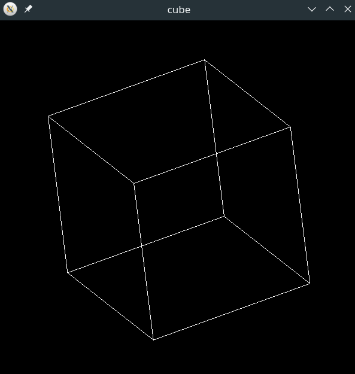

# 3D rotating cube using 2D openGL Rendering

This program displays a 3D spinning cube using 2D rendering with openGL. Matrix operations for projection and rotation are done with gsl.

Run `make` in order to build cube executable.

matrix.c is simply a test file for matricies in gsl.